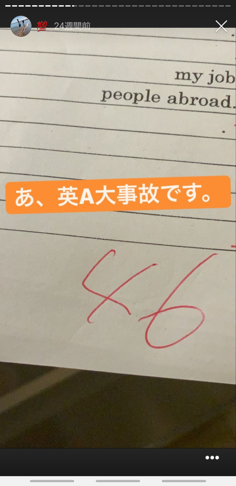

いやお前昨日も更新しとったやんけってか？**う　る　さ　い**

折角このポートフォリオ見てもらっとるんで自己紹介します。

# **This is Rintaro**
こんにちはの方はこんにちは！はじめましての方ははじめまして！鈴鹿高専電子情報工学科在学中の中学時代男子が男性系歌い手にハマるっていう典型的な地雷をしていた不登校プレデターのりんたろーです！(不登校なのは中学の時であって今は学校を楽しんでおります安心してください...)

# **Info about me**

はい！スリーサイズまで公開してありますね~~理想的な~~体型ですね！去年の4月から鈴鹿高専に通ってます(寮生)。なかなか普通科では経験できないことを多く経験してるのではないかなと思います。今年の4月で17歳です！これは僕の[干し芋](https://www.amazon.jp/hz/wishlist/ls/1TOJJDJBN4BPW?ref_=wl_share)なのでぜひ誕生日に私に貢いでください...

# **Upbringing**
私の生い立ちについても少し触れましょう。私は3歳の時に父の仕事の都合上アメリカに流されました。住んどたとこはどこ？って聞かれるとドヤ顔でニューヨークと答えるのですがまぁ郊外なんですけどね(オールバニー)

帰国子女の人はわかると思うんですけど、外国に住んでたと言うだけで「まじ！？なんか喋って！」って言われるの~~うざくないですか~~？僕の場合そんなに英会話が苦手ではないのでまぁ反応しますけど、問題は僕そんなに英語のテストできないんですよね、、、

↑高専の英語のテストで死んだときのやつです、、、ただこれに対し「え、お前帰国子女じゃないん！？wwwwwww」って言ってくるやつに言いたい。**「お前らはいつも会話する時に文法を意識しているか？俺は意識していない」**と。なので帰国子女でも英語はできないんです大目に見てください(;_;)

# **My hobby**
私の趣味についても軽く触れようかと思います。まぁここに関しては別で記事に起こそうかと思ってるんすけどね。

えーと、まず僕は音楽を聞くことと漫画を読むことが好きです。邦ロックをよく聞きます。最推しは[ONE OK ROCK](https://www.oneokrock.com)で次に推してるバンドは[AliA](http://www.alialive.jp)です！どっちも名曲神曲ばかりで聞いてて幸せになれます。

次によく読む漫画なんですけど、めっちゃ[東京喰種](https://youngjump.jp/tokyoghoul/)と[とあるシリーズ](https://toaru-project.com)がめっちゃ好きです。ぜひ読んでみてください！

最後に僕の最推しのVtuberを紹介して書くのをやめようかと思います

**[天 宮 こ こ ろ](https://www.youtube.com/channel/UCkIimWZ9gBJRamKF0rmPU8w)**をすこりましょう。めちゃくちゃ可愛いです。

どう？めっちゃかわいいですよね、、、

まぁ趣味についてはまたの機会に書きます、、、
